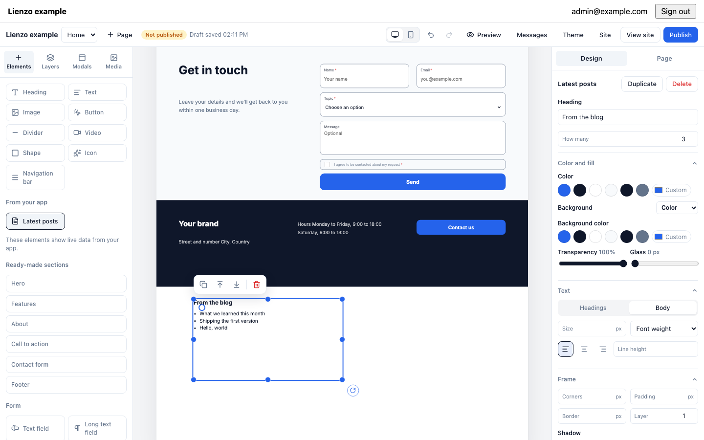
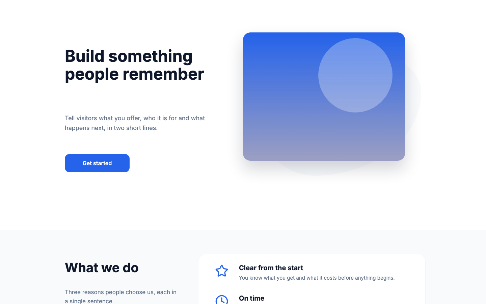

# Lienzo

Lienzo is an open-source landing page builder you add to your own web app. Your admins get a visual editor where they place headings, images, forms and your app's own elements on a free-form canvas, with a separate phone layout. Visitors get fast static HTML with one stylesheet and a small script. Pages are stored as a validated JSON document. A TypeScript renderer and a native PHP renderer turn that document into byte-identical HTML, so a Laravel app needs no Node at runtime. Any other backend can implement the same small HTTP protocol and render with the TypeScript package.





Lienzo has three packages:

| Package | What it is |
| --- | --- |
| [`skylive/lienzo`](packages/laravel) (Composer) | The Laravel integration: tables, editor routes, public pages, uploads, form submissions and the PHP renderer. Ships the editor prebuilt. |
| [`@skylive/lienzo-core`](packages/core) (npm) | The document schema, the renderer, the stylesheet, the page script and the protocol types. No framework. |
| [`@skylive/lienzo-editor`](packages/editor) (npm) | The editor, as a Vue 3 component and as a `<lienzo-editor>` custom element. |

## Laravel quickstart

Lienzo supports Laravel 12 and 13 on PHP 8.3 or later, with the `gd`, `dom`, and `mbstring` extensions. [`examples/laravel`](examples/laravel) is an app built with exactly these steps.

1. Install the package.

    ```sh
    composer require skylive/lienzo
    ```

2. Publish the config and the migration, then migrate.

    ```sh
    php artisan lienzo:install
    php artisan migrate
    ```

    `lienzo:install` also deletes Laravel's stock `public/robots.txt`. Web servers serve files in `public/` before Laravel runs, so that file would hide the `robots.txt` that Lienzo serves. If your `robots.txt` has custom rules, the command keeps it and prints a warning. In that case, add a `Sitemap:` line to it yourself.

3. Say who may edit the site. Define the `lienzo.manage` gate in a service provider, for example in `AppServiceProvider::boot()`:

    ```php
    use Illuminate\Support\Facades\Gate;
    use Skylive\Lienzo\Models\Site;

    Gate::define('lienzo.manage', fn (User $user, Site $site): bool => $user->is_admin);
    ```

4. Register the routes in `routes/web.php`. Put the editor routes inside your authenticated group and `Route::lienzo()` after every other route:

    ```php
    use Skylive\Lienzo\Models\Site;

    Route::middleware('auth')->group(function () {
        Route::get('admin', fn () => view('admin', ['site' => Site::default()]))->name('admin');
        Route::lienzoEditor('admin/site');
    });

    Route::lienzo();
    ```

    `Route::lienzo()` serves published pages at `/` and `/{slug}`, plus `sitemap.xml`, `robots.txt`, the form endpoint and published images. Routes you declare before it win. To serve the site under a prefix, pass it: `Route::lienzo('site')`. To keep a slug free for your app, constrain the returned route: `Route::lienzo()->where('slug', '(?!admin$)[a-z0-9]+(-[a-z0-9]+)*')`.

5. Put the editor on an admin page, for example `resources/views/admin.blade.php`. Give it a height, because the editor fills its element:

    ```blade
    <x-lienzo::editor :site="$site" style="display:block;height:100vh" />
    ```

Open the admin page. The editor asks for a first page. Leave its address empty to make it the home page, then click **Publish**.

### One site per team or tenant

`Site::default()` is the single site of a single-site app. If your app has one site per team or tenant, add the `HasLienzoSite` trait to the owner model, use `Site::forOwner($team)` on the admin page, and tell Lienzo which site a public request is for:

```php
Lienzo::resolveSiteUsing(function (Request $request): ?Site {
    $team = Team::firstWhere('domain', $request->getHost());

    return $team === null ? null : Site::forOwner($team);
});
```

`config/lienzo.php` holds the rest: the database connection, the upload disk and limits, how many published versions to keep, the form rate limit, the editor middleware, and a CDN URL for the editor bundle.

## Other backends

The editor talks to any backend over the HTTP protocol that [`@skylive/lienzo-core/protocol`](packages/core/src/protocol.ts) describes: about a dozen JSON routes for the workspace, pages, publishing, versions, uploads, app element previews and form submissions. To host Lienzo on another stack, do these things:

1. Implement the protocol routes. Validate every draft with `parseDocument(input, catalog)` and answer `422` with its issues. Answer `409` when `baseRevision` is stale.
2. Serve the editor. Load the prebuilt `@skylive/lienzo-editor/standalone` file in a `<script type="module">` and add `<lienzo-editor endpoint="/your/endpoint">`. If your app already uses Vue, import the `LienzoEditor` component from `@skylive/lienzo-editor` instead.
3. Render published pages with `renderPage()`, passing a `RenderHost` that resolves images, app actions, app elements and forms.
4. Store form submissions. Check the posted fields against `formFields()` of the published document, never against what the browser sent.

[`examples/vanilla`](examples/vanilla) does all of this in one file on Node's `node:http` module, with no framework.

## Extend the editor with your app

An app adds three kinds of things to the editor. Each one is declared on the backend, and the editor builds its controls from the declaration. These examples use the Laravel API. Other backends put the same data in the `catalog` they send to the editor.

**Elements with live data.** An app element is a class with a list of fields and a `render` method. Lienzo stores only the field values in the page. `render` runs on every public request and for the editor's preview, so the canvas always shows what visitors get:

```php
use Skylive\Lienzo\Element;
use Skylive\Lienzo\Field;

class LatestPosts extends Element
{
    protected string $type = 'latest_posts';
    protected string|array $label = ['en' => 'Latest posts', 'es' => 'Últimas entradas'];
    protected string $icon = 'file-text';

    public function fields(): array
    {
        return [
            Field::text('heading', 'Heading', max: 60)->default('From the blog'),
            Field::number('count', 'How many', min: 1, max: 6)->default(3),
        ];
    }

    public function render(array $props, Site $site): Htmlable
    {
        return view('elements.latest-posts', [
            'heading' => $props['heading'],
            'posts' => Post::latest()->limit($props['count'])->get(),
        ]);
    }
}

Lienzo::element(LatestPosts::class);
```

Fields come from a closed set: `text`, `number`, `toggle`, `choice`, `image` and `action`. An element can also return scoped CSS from `css()`.

**Actions.** A button or a link can run an app action. The closure turns the stored value into a link, or returns null to render the button inert:

```php
Lienzo::action(
    'book',
    'Book a visit',
    fn (?string $service, Site $site): ?string => $service ? route('booking', $service) : null,
    Field::text('service', 'Service'),
);
```

**Site fields.** Site-wide values, such as a phone number or an analytics id, appear in the editor's site settings and are stored in the site's `meta`:

```php
Lienzo::siteFields(Field::text('phone', 'Phone number', max: 30));
```

`Lienzo::head()` adds trusted markup to every page's `<head>`, and `Lienzo::messages()` overrides the public page strings per locale.

## Security model

Editors are trusted to change content, never to run code. Developers are trusted to run code. Lienzo enforces that line on the server:

- **Documents.** Every save and every render parses the document against one schema: `parseDocument` in TypeScript, and the same JSON Schema walked in PHP. A value of the wrong type or out of range fails the save with the path of the problem, and unknown keys are dropped. Colors must be hex values or theme tokens, fonts must match `^[A-Za-z0-9 ]{1,60}$`, and arrays and strings have size limits.
- **Rendering.** The renderers escape all text, emit only allowlisted tags and attributes, and accept URLs only with `https:`, `http:`, `mailto:`, `tel:`, `/` or `#`. Element styles are CSS custom properties whose values must be numbers, hex colors or theme tokens. No `style` attribute and no URL ever reaches CSS. The only unescaped HTML is what your code returns: app element markup, app element CSS and `Lienzo::head()`. Escape data in it, for example with Blade's `{{ }}`.
- **Editor routes.** Every protocol route runs behind your middleware (`auth` by default) and the `lienzo.manage` gate for that site. Writes need Laravel's CSRF token. The editor echoes the `XSRF-TOKEN` cookie as a header, so no setup is needed.
- **Uploads.** The Laravel package accepts JPG, PNG, WebP, AVIF and SVG within a size limit and a per-site quota. It decodes raster images and re-encodes them as WebP, and it sanitizes SVG. Files are streamed through Lienzo's routes, so the disk can be private. Visitors can load an image only after a published page, the favicon, the share image or a site field uses it.
- **Forms.** A submission is checked against the fields of that form on the published page: required fields, email format, choices and lengths. Extra posted fields are dropped. Forms carry a CSRF token and a honeypot field, and the endpoint is rate limited per visitor.
- **Concurrent edits.** Each save sends the revision it is based on. A stale save gets `409`, and the editor offers to reload, so two tabs never overwrite each other.

## Browser support

Published pages and the editor need container queries, `color-mix()` and CSS nesting. These browsers support all three:

| Browser | Version |
| --- | --- |
| Chrome and Edge | 112 or later |
| Safari | 16.5 or later |
| Firefox | 117 or later |

App element CSS is nested under the element's selector. If it uses nesting that starts with a bare element name, such as `ul { }`, it needs Chrome 120, Safari 17.2 or Firefox 117. Start nested rules with a class to avoid this.

## Contributing

You need Node 24, pnpm 12, PHP 8.3 or later, and Composer.

```sh
pnpm install
composer install
pnpm typecheck && pnpm test && pnpm build
pnpm exec playwright install chromium
pnpm e2e
composer test
```

`pnpm e2e` runs the editor's tests and then both examples. Run `pnpm build` before it, because the examples use the built packages.

Some changes need more than the test suites:

- **Renderer output.** `fixtures/render/*.json` are input documents, and the matching `.html` and `.css` files are the expected output. After a deliberate change to the TypeScript renderer, run `pnpm golden` to rewrite them, and review the diff. The PHP suite renders the same inputs and fails until the PHP renderer produces the same bytes.
- **Shipped assets.** The Composer package ships copies of `lienzo.css`, `runtime.js`, `schema.json`, `data.json` and the standalone editor bundle in `packages/laravel/dist`. After a change to any of them, run `pnpm build && pnpm sync:php`. `composer test` fails while the copies differ from a fresh build.
- **Visual parity.** `pnpm parity` screenshots every fixture document at desktop and phone widths and compares it with the reference render in `fixtures/baseline`.

[docs/releasing.md](docs/releasing.md) lists the release steps.

## License

Lienzo is released under the [MIT license](LICENSE). It includes third-party code under the licenses in [THIRD_PARTY_NOTICES.md](THIRD_PARTY_NOTICES.md).
